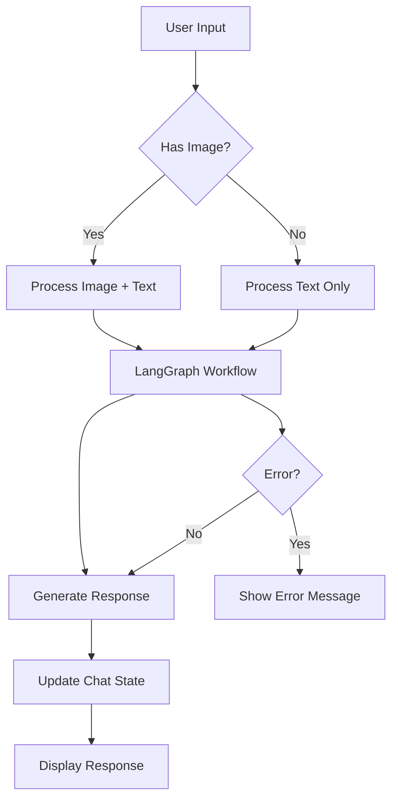

# Design Document

## Overview

The AI Discussion Sidebar will be implemented as a global component that provides users with an interactive chat interface accessible from any page. The feature leverages LangGraph.js for AI integration, follows the Zoovie brand design system using the defined brand colors, and provides a responsive, accessible user experience.

The sidebar will be triggered by a floating action button (FAB) positioned in the bottom right corner of every page. When activated, it slides in from the right as an overlay sidebar on desktop (400px width) or full-screen modal on mobile. The interface includes three main areas: a header with close button, a scrollable message history area, and a fixed input area at the bottom. When no conversation exists, starter prompts will be displayed in the message area to help users begin conversations.

## Architecture

### Technology Stack
- **Frontend Framework**: Next.js 15.4.6 with React 19.1.0
- **AI Integration**: LangGraph.js for conversation management and LLM interactions
- **Styling**: Tailwind CSS 4.1.11 with existing design system from `src/styles/styles.ts`
- **State Management**: React hooks with local state and React Query for server state
- **Form Handling**: React Hook Form 7.62.0 for chat input management
- **Validation**: Zod 4.0.17 for message and file validation
- **File Handling**: Native File API for image attachments

### Component Structure
```
src/features/ai/
├── components/
│   ├── AIChatFAB.tsx (Floating action button trigger)
│   ├── AIChatSidebar.tsx (Main sidebar container with overlay)
│   ├── ChatInterface.tsx (Chat content container)
│   ├── MessageList.tsx (Scrollable message history)
│   ├── MessageBubble.tsx (Individual message display)
│   ├── ChatInput.tsx (Input field with attachment support)
│   ├── StarterPrompts.tsx (Initial prompt suggestions)
│   ├── ImagePreview.tsx (Attached image preview)
│   └── TypingIndicator.tsx (AI response loading state)
├── hooks/
│   ├── useChat.ts (Chat state management)
│   ├── useLangGraph.ts (LangGraph.js integration)
│   ├── useImageUpload.ts (Image handling logic)
│   └── useChatSidebar.ts (Sidebar state management)
├── types/
│   └── chat.ts (TypeScript interfaces)
└── utils/
    ├── langraph-config.ts (LangGraph.js configuration)
    ├── image-processing.ts (Image validation and compression)
    └── message-formatting.ts (Message display utilities)
```

## Components and Interfaces

### Core Components

#### AIChatFAB Component
- **Purpose**: Floating action button that triggers the chat sidebar
- **Props**: `onClick: () => void`, `isOpen: boolean`
- **Features**:
  - Fixed positioning in bottom right corner
  - Brand red background (--brand-red-45) with hover effects
  - Smooth rotation animation when sidebar is open
  - Accessible with proper ARIA labels
  - Responsive sizing for mobile/desktop

#### AIChatSidebar Component
- **Purpose**: Main sidebar container with overlay and slide animations
- **Props**: `isOpen: boolean`, `onClose: () => void`
- **Features**:
  - Overlay background with backdrop blur
  - Slide-in animation from right (desktop) or full-screen (mobile)
  - Click outside to close functionality
  - Escape key handling
  - Brand color theming throughout

#### ChatInterface Component
- **Purpose**: Inner chat content container within the sidebar
- **Props**: None (manages its own state)
- **State**: Manages overall chat state, current conversation, and UI states
- **Responsibilities**:
  - Initialize LangGraph.js connection
  - Coordinate between child components
  - Handle responsive layout adjustments within sidebar
  - Manage error boundaries

#### MessageList Component
- **Purpose**: Displays the conversation history with auto-scrolling
- **Props**: `messages: Message[]`, `isLoading: boolean`
- **Features**:
  - Virtualized scrolling for performance with long conversations
  - Auto-scroll to bottom on new messages
  - Smooth animations for message appearance
  - Loading indicator for AI responses

#### MessageBubble Component
- **Purpose**: Renders individual messages with proper styling
- **Props**: `message: Message`, `isUser: boolean`
- **Features**:
  - Distinct styling for user vs AI messages
  - Support for text and image content
  - Timestamp display
  - Copy message functionality
  - Markdown rendering for AI responses

#### ChatInput Component
- **Purpose**: Handles user input with attachment support
- **Props**: `onSendMessage: (message: string, image?: File) => void`, `disabled: boolean`
- **Features**:
  - Multi-line text input with auto-resize
  - Image attachment with drag-and-drop support
  - Send button with keyboard shortcuts (Enter to send, Shift+Enter for new line)
  - Character count and validation
  - Image preview before sending

#### StarterPrompts Component
- **Purpose**: Displays suggested prompts when no conversation exists
- **Props**: `onSelectPrompt: (prompt: string) => void`
- **Features**:
  - Grid layout of categorized prompts
  - Smooth transition when hiding/showing
  - Responsive design for different screen sizes

### Data Models

```typescript
interface Message {
  id: string
  content: string
  role: 'user' | 'assistant'
  timestamp: Date
  image?: {
    url: string
    alt: string
    size: number
  }
  status: 'sending' | 'sent' | 'error'
}

interface ChatState {
  messages: Message[]
  isLoading: boolean
  error: string | null
  conversationId: string | null
}

interface StarterPrompt {
  id: string
  category: 'creative' | 'analytical' | 'educational' | 'casual'
  title: string
  prompt: string
  icon: string
}

interface ImageAttachment {
  file: File
  preview: string
  isValid: boolean
  error?: string
}
```

## LangGraph.js Integration

### Configuration
- **API Setup**: Configure LangGraph.js with environment variables for API keys
- **Workflow Definition**: Create a conversation workflow that handles:
  - Text-only messages
  - Image analysis requests
  - Context maintenance across conversation turns
  - Error handling and retry logic

### Conversation Flow


### State Management
- **Conversation Context**: Maintain conversation history within LangGraph.js state
- **Session Persistence**: Store conversation state in browser localStorage
- **Error Recovery**: Implement retry mechanisms for failed requests

## Error Handling

### Client-Side Errors
- **Network Issues**: Display retry options with exponential backoff
- **File Upload Errors**: Show specific error messages for file size, format, or upload failures
- **Validation Errors**: Real-time validation feedback for input constraints

### AI Service Errors
- **API Rate Limits**: Queue messages and display wait times
- **Service Unavailable**: Graceful degradation with offline message
- **Invalid Responses**: Fallback error messages with retry options

### Error UI Components
- **Toast Notifications**: For temporary errors and confirmations
- **Inline Error Messages**: For form validation and input errors
- **Error Boundaries**: Catch and display component-level errors

## Testing Strategy

### Unit Testing
- **Component Testing**: Test individual components with React Testing Library
- **Hook Testing**: Test custom hooks with @testing-library/react-hooks
- **Utility Testing**: Test image processing and validation functions
- **Mock LangGraph.js**: Create mock implementations for testing

### Integration Testing
- **Chat Flow Testing**: Test complete conversation flows
- **Image Upload Testing**: Test file handling and validation
- **Error Scenario Testing**: Test error handling and recovery

### E2E Testing
- **User Journey Testing**: Test complete user workflows
- **Cross-Browser Testing**: Ensure compatibility across browsers
- **Responsive Testing**: Test on different screen sizes

### Performance Testing
- **Message List Performance**: Test with large conversation histories
- **Image Upload Performance**: Test with various file sizes
- **Memory Usage**: Monitor for memory leaks in long conversations

## UI/UX Design

### Layout Structure
- **FAB**: Fixed positioned button (bottom: 24px, right: 24px) on all pages
- **Sidebar Overlay**: Full-height overlay with backdrop (desktop: 400px width, mobile: full-screen)
- **Sidebar Header**: Fixed header with Zoovie branding and close button
- **Message Area**: Flexible scrollable area for conversation history
- **Input Area**: Fixed bottom area with input field and controls
- **Responsive Breakpoints**: 
  - Desktop (≥768px): 400px sidebar slides in from right
  - Mobile (<768px): Full-screen modal with slide-up animation

### Visual Design
- **Color Scheme**: Use Zoovie brand colors from globals.css
  - Primary: Brand Red 45 (--brand-red-45: #DA0B0B) for FAB and primary actions
  - Secondary: Brand Blue 45 (--brand-blue-45: #0B7ADA) for AI messages
  - Background: Brand Black variants for dark theme consistency
  - Text: Brand Grey variants for proper contrast
- **Typography**: Use established text styles following the design system
- **Spacing**: Consistent spacing using the 4px grid system
- **Animations**: 
  - Smooth slide-in/out transitions (300ms ease-in-out)
  - FAB rotation animation when active
  - Message appearance animations
  - Typing indicator animations

### Accessibility
- **Keyboard Navigation**: Full keyboard support for all interactions
- **Screen Reader Support**: Proper ARIA labels and semantic HTML
- **Focus Management**: Clear focus indicators and logical tab order
- **Color Contrast**: Ensure WCAG AA compliance for all text and UI elements

### Mobile Optimization
- **Touch Targets**: Minimum 44px touch targets for mobile interactions
- **Viewport Handling**: Proper viewport meta tag and responsive design
- **Input Handling**: Optimize for mobile keyboards and input methods
- **Performance**: Optimize for mobile network conditions

## Security Considerations

### Input Validation
- **Message Content**: Sanitize and validate all user input
- **File Upload**: Validate file types, sizes, and scan for malicious content
- **XSS Prevention**: Proper escaping of user-generated content

### API Security
- **Authentication**: Secure API key management for LangGraph.js
- **Rate Limiting**: Implement client-side rate limiting
- **Data Privacy**: Ensure user conversations are handled securely

### Content Security
- **Image Processing**: Validate and sanitize uploaded images
- **Content Filtering**: Implement appropriate content filtering for AI responses
- **Data Retention**: Clear conversation data appropriately