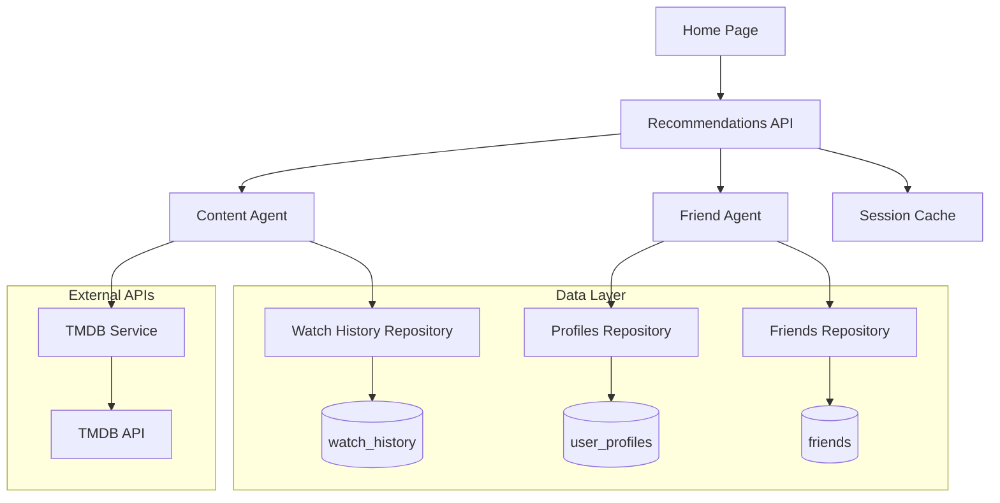

# Design Document

## Overview

The AI Recommendations feature implements a dual-agent system that provides personalized content and friend suggestions to users. The system leverages existing TMDB integration (`src/features/ai-chat/utils/tmdb-tools.ts`), existing watch history repository (`src/features/profile/data/watch-history.repository.ts`), and existing friends system (`src/features/profile/data/friends.repository.ts`). The feature follows MoovyZoo's established architectural patterns and integrates seamlessly with the current home page structure.

The system consists of two main AI agents: a Content Recommendation Agent that reuses existing TMDB tools, and a Friend Suggestion Agent that builds on existing friend and profile repositories. Both agents provide explainable recommendations with transparent scoring and rationale, requiring minimal new database changes.

## Architecture

### High-Level Architecture



### Component Architecture

The feature follows MoovyZoo's established patterns:

- **API Layer**: Next.js API routes for recommendation endpoints
- **Service Layer**: Business logic for recommendation algorithms
- **Repository Layer**: Database access for user data and caching
- **Component Layer**: React components for displaying recommendations
- **Types Layer**: TypeScript interfaces for type safety

## Components and Interfaces

### Core Types

```typescript
// Content Recommendation Types
interface ContentRecommendation {
  tmdb_id: number;
  title: string;
  media_type: 'movie' | 'tv';
  poster_url?: string;
  match_score: number; // 0-100
  short_explanation: string;
  genre_match?: number;
  title_similarity?: number;
  rating_signal?: number;
  friends_boost?: number;
}

// Friend Suggestion Types
interface FriendSuggestion {
  user_id: string;
  display_name: string;
  avatar_url?: string;
  taste_match_score: number; // 0-100
  short_rationale: string;
  shared_titles?: string[];
  shared_genres?: string[];
  mutual_friends_count?: number;
}

// Session Cache Types
interface RecommendationSession {
  user_id: string;
  session_id: string;
  content_recommendations: ContentRecommendation[];
  friend_suggestions: FriendSuggestion[];
  generated_at: Date;
  expires_at: Date;
}

// User Taste Profile
interface TasteProfile {
  user_id: string;
  favorite_genres: string[];
  favorite_titles: string[];
  recent_watches: WatchHistoryEntry[];
  genre_weights: Record<string, number>;
  rating_patterns: {
    average_rating: number;
    rating_distribution: Record<number, number>;
  };
}
```

### Database Schema Extensions

**Note**: Watch history and friends tables already exist in the codebase. Only the recommendation cache table needs to be added.

```sql
-- Recommendation Cache Table (NEW)
CREATE TABLE recommendation_sessions (
  id UUID PRIMARY KEY DEFAULT gen_random_uuid(),
  user_id UUID NOT NULL REFERENCES auth.users(id) ON DELETE CASCADE,
  session_id TEXT NOT NULL,
  content_recommendations JSONB NOT NULL,
  friend_suggestions JSONB NOT NULL,
  generated_at TIMESTAMP WITH TIME ZONE DEFAULT NOW(),
  expires_at TIMESTAMP WITH TIME ZONE NOT NULL,
  UNIQUE(user_id, session_id)
);

-- New Index for Performance
CREATE INDEX idx_recommendation_sessions_user ON recommendation_sessions(user_id, expires_at);
```

**Existing Tables** (already implemented):
- `watch_history` - Available via `src/features/profile/data/watch-history.repository.ts`
- `friends` - Available via `src/features/profile/data/friends.repository.ts`
- `user_profiles` - Available via `src/features/profile/data/profiles.repository.ts`

### API Endpoints

Following existing API patterns from `src/app/api/profiles/[userId]/route.ts` and `src/app/api/watch-history/route.ts`:

```typescript
// GET /api/recommendations
interface RecommendationsResponse {
  success: boolean;
  data: {
    content_recommendations: ContentRecommendation[];
    friend_suggestions: FriendSuggestion[];
    cached: boolean;
    generated_at: string;
  };
  error?: string;
  code?: string;
}

// POST /api/recommendations/refresh
interface RefreshRecommendationsRequest {
  force_refresh?: boolean;
}

interface RefreshRecommendationsResponse {
  success: boolean;
  data: {
    content_recommendations: ContentRecommendation[];
    friend_suggestions: FriendSuggestion[];
    generated_at: string;
  };
  error?: string;
  code?: string;
}
```

### Service Layer Architecture

#### Content Recommendation Agent

```typescript
class ContentRecommendationAgent {
  constructor(
    private watchHistoryRepository: WatchHistoryRepository, // Existing
    private profilesRepository: ProfilesRepository, // Existing
    private friendsRepository: FriendsRepository // Existing
  ) {}

  async generateRecommendations(userId: string): Promise<ContentRecommendation[]> {
    // 1. Build taste profile using existing repositories
    const tasteProfile = await this.buildTasteProfile(userId);
    
    // 2. Generate candidates using existing TMDB tools
    const candidates = await this.generateCandidates(tasteProfile);
    
    // 3. Score and rank candidates
    const scoredRecommendations = await this.scoreRecommendations(candidates, tasteProfile);
    
    // 4. Apply diversity and filtering
    return this.diversifyRecommendations(scoredRecommendations);
  }

  private async buildTasteProfile(userId: string): Promise<TasteProfile> {
    // Use existing watchHistoryRepository.getRecentActivity()
    // Use existing profilesRepository.getByUserId() for favorite_genres/titles
    // Weight recent watches higher, normalize ratings from 1-10 to 0.1-1.0
  }

  private async generateCandidates(profile: TasteProfile): Promise<TMDBContent[]> {
    // Reuse existing TMDB tools from src/features/ai-chat/utils/tmdb-tools.ts:
    // - discoverByGenreTool for genre-based discovery
    // - getSimilarMoviesTool and getSimilarOrRecommendationsTVTool
    // - getTrendingNowOrUpcomingTool for fallbacks
  }

  private async scoreRecommendations(
    candidates: TMDBContent[], 
    profile: TasteProfile
  ): Promise<ContentRecommendation[]> {
    // Apply scoring algorithm:
    // - genre_match (0-50): overlap with favorite_genres from profile
    // - title_similarity (0-20): TMDB similar/recommendations hits
    // - rating_signal (0-20): average rating for similar content from watch_history
    // - friends_boost (0-10): friends' high ratings using friendsRepository
  }
}
```

#### Friend Suggestion Agent

```typescript
class FriendSuggestionAgent {
  constructor(
    private profilesRepository: ProfilesRepository, // Existing
    private friendsRepository: FriendsRepository, // Existing
    private watchHistoryRepository: WatchHistoryRepository // Existing
  ) {}

  async generateSuggestions(userId: string): Promise<FriendSuggestion[]> {
    // 1. Get candidate pool using existing profilesRepository.getPublicProfiles()
    const candidates = await this.getCandidatePool(userId);
    
    // 2. Calculate taste similarity scores
    const scoredSuggestions = await this.calculateTasteSimilarity(userId, candidates);
    
    // 3. Rank and filter suggestions
    return this.rankSuggestions(scoredSuggestions);
  }

  private async getCandidatePool(userId: string): Promise<UserProfile[]> {
    // Use existing profilesRepository.getPublicProfiles(userId) to exclude current user
    // Use existing friendsRepository.getFriends(userId) to exclude existing friends
  }

  private async calculateTasteSimilarity(
    userId: string, 
    candidates: UserProfile[]
  ): Promise<FriendSuggestion[]> {
    // Score based on:
    // - shared_high_rated_titles (60%): mutual ratings >= 8 using watchHistoryRepository
    // - shared_genres (25%): favorite_genres overlap from user_profiles
    // - shared_habitats (15%): common habitat membership (future enhancement)
  }
}
```

### Component Layer

#### Recommendation Cards

Following existing card patterns from `src/components/cards/StreamCard.tsx`:

```typescript
// Content Recommendation Card (NEW)
interface ContentRecommendationCardProps {
  recommendation: ContentRecommendation;
  onCardClick: (tmdbId: number, mediaType: 'movie' | 'tv') => void;
  className?: string;
}

// Friend Suggestion Card (NEW)
interface FriendSuggestionCardProps {
  suggestion: FriendSuggestion;
  onProfileClick: (userId: string) => void;
  onSendFriendRequest: (userId: string) => void;
  currentUserId: string;
  className?: string;
}

// Recommendations Section Component (NEW)
interface RecommendationsSectionProps {
  contentRecommendations: ContentRecommendation[];
  friendSuggestions: FriendSuggestion[];
  isLoading: boolean;
  error?: string;
  onRefreshRecommendations: () => void;
  onContentClick: (tmdbId: number, mediaType: 'movie' | 'tv') => void;
  onFriendClick: (userId: string) => void;
}
```

#### Home Page Integration

Updating existing `src/app/(app)/page.tsx`:

```typescript
// Enhanced Home Page Component
export default function Home() {
  const { user } = useUser();
  const { profile } = useProfile(user?.id);
  const { 
    recommendations, 
    isLoading, 
    error,
    refreshRecommendations 
  } = useRecommendations(user?.id);

  const handleContentClick = (tmdbId: number, mediaType: 'movie' | 'tv') => {
    // Navigate to content details or add to watch history
  };

  const handleFriendClick = (userId: string) => {
    // Navigate to user profile
  };

  return (
    <div className="space-y-6">
      {/* Existing welcome section */}
      <div className="mt-2">
        <h1 className="text-3xl md:text-4xl font-extrabold tracking-tight">
          <span className="text-foreground/80">Welcome, </span>
          <span className="text-primary drop-shadow-[0_2px_10px_rgba(229,9,20,0.35)]">
            {profile?.displayName || "User"}
          </span>
        </h1>
        <p className="text-sm text-muted-foreground mt-1">What would you like to watch or explore today?</p>
      </div>
      
      {/* New recommendations section */}
      <RecommendationsSection
        contentRecommendations={recommendations?.content_recommendations || []}
        friendSuggestions={recommendations?.friend_suggestions || []}
        isLoading={isLoading}
        error={error}
        onRefreshRecommendations={refreshRecommendations}
        onContentClick={handleContentClick}
        onFriendClick={handleFriendClick}
      />
      
      {/* Existing mock watch history */}
      <MockWatchHistoryDemo />
    </div>
  );
}
```

## Data Models

### Repository Layer

**Existing Repositories** (already implemented):

```typescript
// Watch History Repository (EXISTING)
// Located: src/features/profile/data/watch-history.repository.ts
class WatchHistoryRepository {
  async addWatchEntry(data: CreateWatchHistoryData): Promise<WatchHistoryEntry>;
  async getUserWatchHistory(userId: string, limit?: number): Promise<WatchHistoryEntry[]>;
  async getRecentActivity(userId: string, limit?: number): Promise<WatchHistoryEntry[]>;
  async getWatchEntry(userId: string, movieId: string): Promise<WatchHistoryEntry | null>;
  async updateWatchEntry(id: string, updates: UpdateWatchHistoryData): Promise<WatchHistoryEntry>;
  async deleteWatchEntry(id: string): Promise<void>;
}

// Friends Repository (EXISTING)
// Located: src/features/profile/data/friends.repository.ts
class FriendsRepository {
  async sendFriendRequest(requesterId: string, receiverId: string): Promise<Friend>;
  async acceptFriendRequest(requestId: string): Promise<Friend>;
  async getFriendStatus(userId1: string, userId2: string): Promise<FriendStatus>;
  async getFriends(userId: string): Promise<UserProfile[]>;
  async getPendingRequests(userId: string): Promise<FriendRequest[]>;
  async removeFriend(userId: string, friendId: string): Promise<void>;
}

// Profiles Repository (EXISTING)
// Located: src/features/profile/data/profiles.repository.ts
class ProfilesRepository {
  async getByUserId(userId: string): Promise<UserProfile>;
  async getPublicProfiles(currentUserId?: string, limit?: number): Promise<PublicProfile[]>;
  async getPublicProfilesWithFriendStatus(currentUserId: string): Promise<ProfileWithFriendStatus[]>;
}
```

**New Repository** (to be implemented):

```typescript
// Recommendation Cache Repository (NEW)
class RecommendationCacheRepository {
  async getCachedRecommendations(userId: string, sessionId: string): Promise<RecommendationSession | null>;
  async cacheRecommendations(session: RecommendationSession): Promise<void>;
  async clearExpiredCache(): Promise<void>;
  async invalidateUserCache(userId: string): Promise<void>;
}
```

### Service Layer Integration

```typescript
// Recommendations Service
class RecommendationsService {
  constructor(
    private contentAgent: ContentRecommendationAgent,
    private friendAgent: FriendSuggestionAgent,
    private cacheRepository: RecommendationCacheRepository
  ) {}

  async getRecommendations(userId: string, sessionId: string, forceRefresh = false): Promise<{
    content_recommendations: ContentRecommendation[];
    friend_suggestions: FriendSuggestion[];
    cached: boolean;
  }> {
    // Check cache first unless force refresh
    if (!forceRefresh) {
      const cached = await this.cacheRepository.getCachedRecommendations(userId, sessionId);
      if (cached && cached.expires_at > new Date()) {
        return {
          content_recommendations: cached.content_recommendations,
          friend_suggestions: cached.friend_suggestions,
          cached: true
        };
      }
    }

    // Generate fresh recommendations
    const [contentRecs, friendSuggestions] = await Promise.all([
      this.contentAgent.generateRecommendations(userId),
      this.friendAgent.generateSuggestions(userId)
    ]);

    // Cache the results
    const session: RecommendationSession = {
      user_id: userId,
      session_id: sessionId,
      content_recommendations: contentRecs,
      friend_suggestions: friendSuggestions,
      generated_at: new Date(),
      expires_at: new Date(Date.now() + 24 * 60 * 60 * 1000) // 24 hours
    };

    await this.cacheRepository.cacheRecommendations(session);

    return {
      content_recommendations: contentRecs,
      friend_suggestions: friendSuggestions,
      cached: false
    };
  }
}
```

## Error Handling

### Error Types and Codes

```typescript
enum RecommendationErrorCode {
  INSUFFICIENT_DATA = 'INSUFFICIENT_DATA',
  TMDB_API_ERROR = 'TMDB_API_ERROR',
  CACHE_ERROR = 'CACHE_ERROR',
  INVALID_USER_DATA = 'INVALID_USER_DATA',
  RATE_LIMIT_EXCEEDED = 'RATE_LIMIT_EXCEEDED'
}

interface RecommendationError {
  code: RecommendationErrorCode;
  message: string;
  fallback_strategy?: string;
}
```

### Fallback Strategies

1. **Cold Start Users**: Use favorite_genres and favorite_titles from profiles
2. **TMDB API Failures**: Fall back to popular content in user's top genres
3. **Cache Failures**: Generate recommendations in real-time
4. **Rate Limiting**: Implement exponential backoff and queue requests
5. **Insufficient Friend Data**: Focus on content recommendations only

### Error Boundaries and User Experience

```typescript
// Recommendation Error Boundary
class RecommendationErrorBoundary extends React.Component {
  state = { hasError: false, error: null };

  static getDerivedStateFromError(error: Error) {
    return { hasError: true, error };
  }

  render() {
    if (this.state.hasError) {
      return (
        <ErrorState
          title="Unable to load recommendations"
          message="We're having trouble generating your personalized recommendations."
          action={{
            label: "Try Again",
            onClick: () => this.setState({ hasError: false, error: null })
          }}
        />
      );
    }

    return this.props.children;
  }
}
```

## Testing Strategy

### Unit Testing

1. **Algorithm Testing**: Test scoring algorithms with known data sets
2. **Repository Testing**: Mock database operations and test data transformations
3. **Service Testing**: Test business logic with various user profiles
4. **Component Testing**: Test UI components with different recommendation states

### Integration Testing

1. **API Testing**: Test recommendation endpoints with real user data
2. **TMDB Integration**: Test external API calls and error handling
3. **Database Testing**: Test complex queries and performance
4. **Cache Testing**: Test session management and expiration

### Performance Testing

1. **Load Testing**: Test recommendation generation under high user load
2. **TMDB Rate Limiting**: Test API rate limit handling and fallbacks
3. **Database Performance**: Test query performance with large datasets
4. **Cache Efficiency**: Test cache hit rates and memory usage

### Test Data Strategy

```typescript
// Test User Profiles
const testProfiles = {
  coldStartUser: {
    favorite_genres: ['Action', 'Sci-Fi'],
    favorite_titles: ['Inception', 'The Matrix'],
    watch_history: []
  },
  activeUser: {
    favorite_genres: ['Drama', 'Thriller'],
    favorite_titles: ['Parasite', 'Gone Girl'],
    watch_history: [
      { title: 'Parasite', rating: 9, watched_at: '2024-01-15' },
      { title: 'Knives Out', rating: 8, watched_at: '2024-01-10' }
    ]
  },
  socialUser: {
    // User with many friends and shared ratings
    friends: ['user2', 'user3', 'user4'],
    shared_high_ratings: [
      { title: 'Dune', rating: 9, shared_with: ['user2', 'user3'] }
    ]
  }
};
```

## Performance Considerations

### Leveraging Existing Optimizations

1. **TMDB Integration**: Reuse existing optimized TMDB tools from `src/features/ai-chat/utils/tmdb-tools.ts`
2. **Database Indices**: Leverage existing indices on watch_history and friends tables
3. **Repository Patterns**: Use existing optimized repository methods
4. **API Caching**: Build on existing API response patterns

### Caching Strategy

1. **Session-based Caching**: Cache recommendations for 24 hours using new recommendation_sessions table
2. **TMDB Response Reuse**: Leverage existing TMDB API calls and caching from AI chat feature
3. **Repository Caching**: Use existing repository-level optimizations
4. **Manual Refresh**: Allow users to force refresh recommendations

### Database Optimization

1. **Existing Indices**: Use existing `idx_watch_history_user_recent` and `idx_friends_*` indices
2. **Minimal New Queries**: Only add recommendation_sessions table queries
3. **Batch Operations**: Use existing repository batch methods where available
4. **Query Efficiency**: Leverage existing optimized queries from profiles and friends repositories

### TMDB API Optimization

1. **Reuse Existing Tools**: Use existing TMDB tools that already implement best practices
2. **Batch Requests**: Leverage existing `append_to_response` usage in TMDB repository
3. **Rate Limiting**: Build on existing TMDB API rate limiting patterns
4. **Fallback Strategies**: Use existing trending and popular content endpoints for fallbacks

### Monitoring and Metrics

```typescript
interface RecommendationMetrics {
  generation_time_ms: number;
  cache_hit_rate: number;
  tmdb_tools_reused: string[];
  fallback_usage_rate: number;
  error_rate: number;
  user_engagement_rate: number;
}
```

## Security and Privacy

### Data Protection

1. **Privacy Settings**: Respect user privacy settings for friend suggestions
2. **Data Minimization**: Only store necessary recommendation data
3. **Secure Caching**: Encrypt cached recommendation data
4. **Access Controls**: Ensure users can only access their own recommendations

### Rate Limiting and Abuse Prevention

1. **API Rate Limiting**: Limit recommendation requests per user
2. **TMDB Quota Management**: Monitor and manage TMDB API usage
3. **Cache Poisoning Prevention**: Validate cached data integrity
4. **User Behavior Monitoring**: Detect and prevent abuse patterns