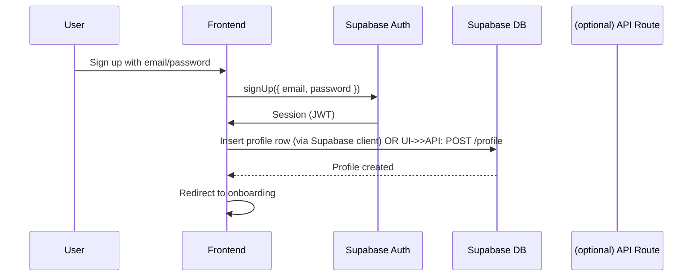

# Design Document – Auth & Profiles (MoovyZoo)

## Overview

The Auth & Profiles feature provides the foundational identity layer for **MoovyZoo**, enabling user registration, authentication, profile management, and personalization. It integrates with **Supabase Auth** and **Supabase Postgres** (with Row Level Security) to deliver a secure, scalable base for core experiences: **Habitats (group chats)**, **Watch Parties**, **AI Discussion Mode**, **Recommendations (movies & friends)**, and **Group Games** (Binge Race, Role‑Based Chat).

The design follows a **feature-folder** structure with clear separation of concerns (auth logic, profile management, UI components). All forms are validated with **Zod**, and server state is coordinated via **TanStack Query**.

---

## Architecture

### High-Level Architecture

```mermaid
graph TB
    UI[Next.js Frontend] --> API[Next.js API Routes (optional)]
    UI --> SupabaseAuth[Supabase Auth]
    API --> SupabaseDB[(Supabase Postgres)]
    SupabaseAuth --> SupabaseDB
    UI --> TanStack[TanStack Query]
    TanStack --> API
```

> Note: Most reads/writes use the Supabase client directly with RLS. API routes or Edge Functions are optional (e.g., for privileged operations or complex aggregation).

### Authentication Flow



---

## Technology Stack Integration

- **Frontend:** Next.js 14+ (App Router) + TypeScript + TailwindCSS
- **Auth:** Supabase Auth (email/password; OAuth optional later)
- **Database:** Supabase Postgres (+ RLS) for profiles, preferences
- **Realtime:** Supabase Realtime (for presence and live UI elsewhere)
- **State:** TanStack Query for server state and caching
- **Validation:** Zod schemas for forms and DTOs
- **Styling:** Tailwind (clean usage via `clsx` + `styles.ts`/`@apply`)

---

## Components and Interfaces

### Core Components Structure

```
/features/auth-profiles/
├── components/
│   ├── auth/
│   │   ├── SignupForm.tsx
│   │   ├── LoginForm.tsx
│   │   └── AuthLayout.tsx
│   ├── profile/
│   │   ├── ProfileForm.tsx
│   │   ├── ProfileView.tsx
│   │   └── PrivacySettings.tsx
│   └── onboarding/
│       ├── OnboardingFlow.tsx
│       ├── GenreSelection.tsx
│       ├── FavoriteTitles.tsx
│       └── OnboardingLayout.tsx
├── hooks/
│   ├── useAuth.ts
│   ├── useProfile.ts
│   └── useOnboarding.ts
├── api/                 # optional—most ops via Supabase client
│   ├── profile.ts
│   └── index.ts
├── types/
│   ├── auth.ts
│   ├── profile.ts
│   └── onboarding.ts
└── utils/
    ├── supabase-client.ts
    ├── validation.ts
    └── auth-helpers.ts
```

---

### Key Interfaces

#### Authentication Types

```ts
export interface User {
  id: string;
  email: string;
  emailVerified: boolean;
  createdAt: Date;
  lastLoginAt: Date;
}

export interface AuthState {
  user: User | null;
  loading: boolean;
  error: string | null;
}
```

#### Profile Types

```ts
export interface UserProfile {
  id: string; // same as auth user id (UUID)
  displayName: string;
  avatarUrl?: string;
  bio?: string;

  favoriteGenres: string[]; // e.g., ["sci-fi", "rom-com"]
  favoriteTitles: string[]; // e.g., ["Blade Runner", "Pride & Prejudice"]

  isPublic: boolean; // profile discoverability
  onboardingCompleted: boolean;

  createdAt: Date;
  updatedAt: Date;
}
```

#### Onboarding Types (updated)

```ts
export interface OnboardingData {
  displayName: string;
  avatarUrl?: string;
  bio?: string;

  favoriteGenres: string[];
  favoriteTitles: string[];

  privacy: { isPublic: boolean };
  notifications?: {
    habitats: boolean;
    parties: boolean;
    recommendations: boolean;
  };
}
```

---

### Component Specifications

#### SignupForm

- Email/password inputs with real-time validation (Zod)
- Follow best form practices for scalability (e.g. hooks/React hook form, FormLayout component or FormProvider)
- Password strength guidance
- Integration with **Supabase Auth**
- Friendly error messages (via centralized Error Code System)
- Redirect to **OnboardingFlow** on success

#### OnboardingFlow

- Multi-step wizard:
  - Display name, avatar (URL or upload)
  - Favorite genres (chips/cards)
  - Favorite titles (searchable input)
  - Privacy + notifications
- Suggested **Habitats** to join after preferences saved
- Progress indicator and “finish later” option

#### ProfileForm

- Edit displayName, avatar, bio
- Manage favoriteGenres/titles
- Privacy toggle
- “Save” confirmation toast; optimistic UI
- Respects **RLS** (cannot write other users’ profiles)

---

## Data Models

### Supabase Schema (profiles)

```sql
-- profiles table
create table if not exists public.profiles (
  id uuid primary key references auth.users(id) on delete cascade,
  email text not null,
  display_name text not null,
  avatar_url text,
  bio text,
  favorite_genres text[] default '{}',
  favorite_titles text[] default '{}',
  is_public boolean default true,
  onboarding_completed boolean default false,
  created_at timestamptz default now(),
  updated_at timestamptz default now()
);

-- helpful indexes
create index if not exists idx_profiles_public on public.profiles (is_public);
create index if not exists idx_profiles_display_name on public.profiles (display_name);

-- triggers to keep updated_at fresh
create or replace function public.set_updated_at()
returns trigger as $$
begin
  new.updated_at = now();
  return new;
end;
$$ language plpgsql;

drop trigger if exists trg_profiles_updated_at on public.profiles;
create trigger trg_profiles_updated_at
before update on public.profiles
for each row execute function public.set_updated_at();
```

---

## Security (Row Level Security)

```sql
alter table public.profiles enable row level security;

create policy "profiles_select_own"
on public.profiles for select
using (auth.uid() = id);

create policy "profiles_select_public"
on public.profiles for select
using (is_public = true);

create policy "profiles_insert_own"
on public.profiles for insert
with check (auth.uid() = id);

create policy "profiles_update_own"
on public.profiles for update
using (auth.uid() = id)
with check (auth.uid() = id);
```

---

## Error Handling

Centralize errors via an **Error Code System**:

- Map Supabase errors and Zod errors to `AppErrorCode`.
- Convert codes to ≤140‑char user messages in MoovyZoo’s tone.
- Never show raw SQL or stack traces to end users.
- Log raw error + normalized code for dev/telemetry.

---

## Testing Strategy

**Unit**

- Zod schemas (auth, onboarding, profile)
- Hooks (`useAuth`, `useProfile`) with mocked Supabase client
- Error normalizers → `AppErrorCode`

**Integration**

- Signup → Onboarding → Profile update happy path
- Login/logout persistence
- Privacy toggle: public vs private read behavior

**Security (RLS)**

- Supabase local dev/CLI:
  - Authenticated user can read/update only their own profile
  - Authenticated user can read public profiles
  - Unauthorized updates blocked

---

## Performance Considerations

- Cache `profiles` via TanStack Query
- Use Next.js Image for avatars
- Lazy load heavy UI
- Use `select` projections to minimize payloads

---

## Integration Points

- **Habitats:** displayName/avatar in chats; privacy respected
- **Watch Parties:** profile info in lobby;
- **Recommendations:** based on genres/titles
- **Group Games:** badges visible on profile
