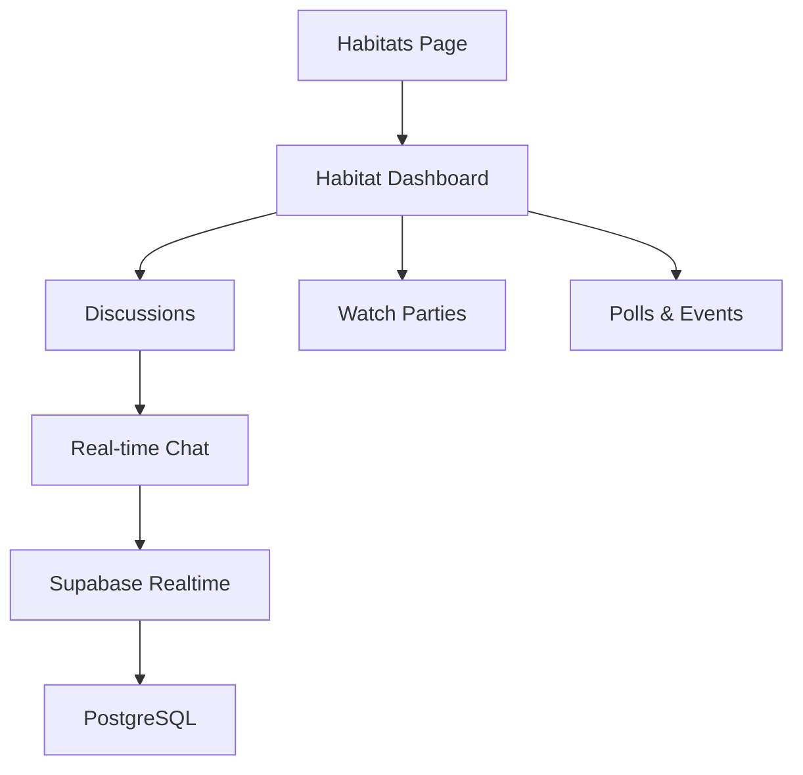

# Design Document

## Overview

The Habitats feature creates themed social spaces where users can engage in discussions, activities, and events around movies and TV shows. The system centers around a dashboard-based approach where each habitat has a central overview page displaying ongoing activities, discussions, watch parties, and events. Users can then navigate to specific chat rooms for focused discussions. The system leverages Supabase's real-time capabilities for chat and PostgreSQL for data persistence.

## Architecture

### High-Level Architecture



### Data Flow

1. **User Navigation**: Users view their joined habitats → select habitat → view dashboard → navigate to specific activities
2. **Dashboard Data**: Aggregated data from multiple sources (discussions, events, members, watch parties)
3. **Real-time Communication**: Messages flow through Supabase Realtime channels per discussion room
4. **Activity Persistence**: Chat messages, polls, and events stored in PostgreSQL

## Components and Interfaces

### Core Components

#### 1. Your Habitats (`HabitatList`)

- **Purpose**: Display user's joined habitats
- **Props**: `userHabitats: Habitat[]`, `onHabitatSelect: (id: string) => void`
- **Features**: List layout, activity indicators, member count display, empty state

#### 2. Habitat Dashboard (`HabitatDashboard`)

- **Purpose**: Central overview page for each habitat
- **Props**: `habitatId: string`, `habitat: Habitat`, `user: User`
- **Features**:
  - Hero section with habitat branding and primary actions
  - Popular discussions and polls section
  - Weekly watch parties section
  - Habitat information sidebar (creation date, tags, members)
  - Ongoing events section
  - Navigation to specific chat rooms

#### 3. Discussion Room (`DiscussionRoom`)

- **Purpose**: Individual discussion room interface for focused discussions
- **Props**: `habitatId: string`, `discussionId: string`, `user: User`
- **Features**: Real-time chat specific to the discussion room, breadcrumb navigation back to dashboard

#### 4. Real-time Chat (`ChatInterface`)

- **Purpose**: Handle message display and input for specific chat rooms
- **Props**: `habitatId: string`, `discussionId: string`, `messages: Message[]`, `onSendMessage: (content: string) => void`
- **Features**: Message history, message input, room-specific messaging

#### 5. Dashboard Sections

##### Popular Discussions (`PopularDiscussions`)

- **Purpose**: Display active discussions
- **Props**: `discussions: Discussion[]`, `onDiscussionClick: (id: string) => void`
- **Features**: List of active discussions with vote counts and participant counts

##### Watch Parties (`WatchParties`)

- **Purpose**: Display upcoming and active watch parties ordered by start date and time
- **Props**: `watchParties: WatchParty[]`, `onJoinParty: (id: string) => void`
- **Features**: Party details, join buttons, participant counts

##### Habitat Info (`HabitatInfo`)

- **Purpose**: Display habitat metadata and member information
- **Props**: `habitat: Habitat`, `members: HabitatMember[]`
- **Features**: Creation date, tags, member statistics, online member indicators

#### 6. Creation Components

##### Discussion Creation Form (`DiscussionCreationForm`)

- **Purpose**: Form for creating new discussions within a habitat
- **Props**: `habitatId: string`, `onSuccess: (discussion: Discussion) => void`, `onCancel: () => void`
- **Features**:
  - Discussion name input (3-100 characters)
  - Optional description textarea (max 500 characters)
  - Form validation with real-time feedback
  - Submit and cancel actions
  - Error handling and loading states

##### Poll Creation Form (`PollCreationForm`)

- **Purpose**: Form for creating new polls within a habitat
- **Props**: `habitatId: string`, `onSuccess: (poll: Poll) => void`, `onCancel: () => void`
- **Features**:
  - Poll title input (5-200 characters)
  - Dynamic poll options management (2-6 options, 1-100 characters each)
  - Add/remove option buttons
  - Form validation with real-time feedback
  - Submit and cancel actions
  - Error handling and loading states

##### Watch Party Creation Form (`WatchPartyCreationForm`)

- **Purpose**: Form for creating new watch parties within a habitat
- **Props**: `habitatId: string`, `onSuccess: (watchParty: WatchParty) => void`, `onCancel: () => void`
- **Features**:
  - Party title input (5-200 characters)
  - Optional description textarea (max 500 characters)
  - Date and time picker for scheduling (must be future)
  - Optional maximum participants input
  - Form validation with real-time feedback
  - Submit and cancel actions
  - Error handling and loading states

##### Creation Modals

- **DiscussionCreationModal**: Modal wrapper using Shadcn UI Dialog component
- **PollCreationModal**: Modal wrapper using Shadcn UI Dialog component
- **WatchPartyCreationModal**: Modal wrapper using Shadcn UI Dialog component
- **Features**:
  - Built on Shadcn UI Dialog (`@/components/ui/dialog`)
  - Uses Dialog, DialogContent, DialogHeader, DialogTitle, DialogFooter components
  - Consistent modal styling with backdrop click handling and escape key support
  - Proper accessibility with focus management and ARIA attributes
  - Responsive design with mobile-first approach

### Data Models

#### Habitat

```typescript
interface Habitat {
  id: string;
  name: string;
  description: string;
  tags: string[];
  member_count: number;
  is_public: boolean;
  created_by: string;
  created_at: string;
  updated_at: string;
  banner_url?: string;
}
```

#### Message

```typescript
interface Message {
  id: string;
  habitat_id: string;
  chat_id: string;
  user_id: string;
  content: string;
  created_at: string;
  user_profile?: {
    display_name: string;
    avatar_url?: string;
  };
}
```

#### Discussions

```typescript
interface Discussion {
  id: string;
  habitat_id: string;
  name: string;
  description?: string;
  created_by: string;
  created_at: string;
  is_active: boolean;
}
```

#### Polls

```typescript
interface Poll {
  id: string;
  habitat_id: string;
  title: string;
  options: Record<string, number>;
  created_by: string;
  created_at: string;
  is_active: boolean;
}
```

#### WatchParty

```typescript
interface WatchParty {
  id: string;
  habitat_id: string;
  title: string;
  description?: string;
  scheduled_time: string;
  participant_count: number;
  max_participants?: number;
  created_by: string;
  created_at: string;
  is_active: boolean;
}
```

#### HabitatMember

```typescript
interface HabitatMember {
  habitat_id: string;
  user_id: string;
  joined_at: string;
  last_active: string;
}
```

#### Creation Form Data

```typescript
interface DiscussionCreationData {
  name: string;
  description?: string;
}

interface PollCreationData {
  title: string;
  options: string[];
}

interface WatchPartyCreationData {
  title: string;
  description?: string;
  scheduled_time: Date;
  max_participants?: number;
}
```

### Database Schema

#### Tables

```sql
-- Habitats table
CREATE TABLE habitats (
  id UUID PRIMARY KEY DEFAULT gen_random_uuid(),
  name VARCHAR(100) NOT NULL,
  description TEXT,
  tags TEXT[] DEFAULT '{}',
  is_public BOOLEAN DEFAULT true,
  created_by UUID REFERENCES user_profiles(id),
  created_at TIMESTAMP DEFAULT NOW(),
  updated_at TIMESTAMP DEFAULT NOW(),
  banner_url TEXT,
  member_count INTEGER DEFAULT 0
);

-- Habitat members table
CREATE TABLE habitat_members (
  habitat_id UUID REFERENCES habitats(id) ON DELETE CASCADE,
  user_id UUID REFERENCES user_profiles(id) ON DELETE CASCADE,
  joined_at TIMESTAMP DEFAULT NOW(),
  last_active TIMESTAMP DEFAULT NOW(),
  PRIMARY KEY (habitat_id, user_id)
);

-- Chat rooms table
CREATE TABLE habitat_discussions (
  id UUID PRIMARY KEY DEFAULT gen_random_uuid(),
  habitat_id UUID REFERENCES habitats(id) ON DELETE CASCADE,
  name VARCHAR(100) NOT NULL,
  description TEXT,
  created_by UUID REFERENCES user_profiles(id),
  created_at TIMESTAMP DEFAULT NOW(),
  is_active BOOLEAN DEFAULT true
);

-- Messages table (updated to include chat_id)
CREATE TABLE habitat_messages (
  id UUID PRIMARY KEY DEFAULT gen_random_uuid(),
  habitat_id UUID REFERENCES habitats(id) ON DELETE CASCADE,
  chat_id UUID REFERENCES habitat_chat_rooms(id) ON DELETE CASCADE,
  user_id UUID REFERENCES profiles(id) ON DELETE CASCADE,
  content TEXT NOT NULL CHECK (length(content) <= 1000),
  created_at TIMESTAMP DEFAULT NOW()
);

-- Polls table
CREATE TABLE habitat_polls (
  id UUID PRIMARY KEY DEFAULT gen_random_uuid(),
  habitat_id UUID REFERENCES habitats(id) ON DELETE CASCADE,
  title VARCHAR(200) NOT NULL,
  options JSON,
  created_by UUID REFERENCES user_profiles(id),
  created_at TIMESTAMP DEFAULT NOW(),
  is_active BOOLEAN DEFAULT true
);

-- Watch parties table
CREATE TABLE habitat_watch_parties (
  id UUID PRIMARY KEY DEFAULT gen_random_uuid(),
  habitat_id UUID REFERENCES habitats(id) ON DELETE CASCADE,
  title VARCHAR(200) NOT NULL,
  description TEXT,
  scheduled_time TIMESTAMP NOT NULL,
  participant_count INTEGER DEFAULT 0,
  max_participants INTEGER,
  created_by UUID REFERENCES user_profiles(id),
  created_at TIMESTAMP DEFAULT NOW(),
  is_active BOOLEAN DEFAULT true
);
```

## Error Handling

### Error Categories

1. **Authentication Errors**: User not logged in or insufficient permissions
2. **Real-time Connection Errors**: WebSocket disconnections, reconnection logic
3. **Database Errors**: Failed queries, constraint violations
4. **Validation Errors**: Form validation failures, invalid input data
5. **Creation Errors**: Failed content creation

### Error Handling Strategy

- Use centralized error mapping from `error-map.ts`
- Implement retry logic for real-time connections
- Get user-friendly error messages following brand voice using the `getFriendErrorMessage` method
- Form-specific validation with real-time feedback
- Graceful degradation for creation failures

### Example Error Codes

```typescript
enum HabitatErrorCode {
  HABITAT_NOT_FOUND = "HABITAT_NOT_FOUND",
  ACCESS_DENIED = "ACCESS_DENIED",
  MESSAGE_TOO_LONG = "MESSAGE_TOO_LONG",
  REALTIME_CONNECTION_FAILED = "REALTIME_CONNECTION_FAILED",
}
```

## Testing Strategy

### Unit Tests

- Component rendering and prop handling
- Message validation logic
- Error handling functions
- Data transformation utilities

### Integration Tests

- Real-time message flow
- Database operations (CRUD for habitats and messages)
- Authentication and authorization

### End-to-End Tests

- Complete user journey: browse → join → chat
- Multi-user chat scenarios
- Real-time synchronization across multiple clients
- Mobile responsiveness

## Dialog Component Architecture

### Shadcn UI Dialog Integration

All creation modals use the Shadcn UI Dialog component system for consistency and accessibility:

```typescript
import {
  Dialog,
  DialogContent,
  DialogHeader,
  DialogTitle,
  DialogFooter,
} from "@/components/ui/dialog";
import { Button } from "@/components/ui/button";
```

### Modal Structure Pattern

Each creation modal follows this consistent structure:

```tsx
<Dialog open={isOpen} onOpenChange={setIsOpen}>
  <DialogContent className="sm:max-w-md">
    <DialogHeader>
      <DialogTitle>Create [Content Type]</DialogTitle>
    </DialogHeader>

    {/* Form Component */}
    <[ContentType]CreationForm
      habitatId={habitatId}
      onSuccess={handleSuccess}
      onCancel={handleCancel}
    />

    <DialogFooter>
      <Button variant="outline" onClick={handleCancel}>
        Cancel
      </Button>
      <Button type="submit" form="creation-form">
        Create [Content Type]
      </Button>
    </DialogFooter>
  </DialogContent>
</Dialog>
```

### Dialog State Management

- Modal state managed by parent component (HabitatDashboard)
- Form submission handled within form components
- Success/error states communicated via callbacks
- Automatic modal closing on successful creation

## Creation Workflow Design

### User Experience Flow

#### Discussion Creation

1. User clicks "Create Discussion" button (to be added to dashboard)
2. Modal opens with discussion creation form
3. User fills in discussion name (required) and optional description
4. Real-time validation provides immediate feedback
5. On successful creation, user is navigated to the new discussion room
6. Dashboard updates to show the new discussion in the popular section

#### Poll Creation

1. User clicks "Create Poll" button in hero section
2. Modal opens with poll creation form
3. User enters poll title and adds options (minimum 2, maximum 6)
4. Dynamic option management allows adding/removing options
5. Real-time validation ensures all requirements are met
6. On successful creation, poll appears in "Popular in this habitat" section
7. Modal closes and user sees confirmation

#### Watch Party Creation

1. User clicks "Start Streaming Party" button in hero section
2. Modal opens with watch party creation form
3. User enters party title, optional description, and scheduled time
4. Date/time picker ensures future scheduling
5. Optional maximum participants can be set
6. On successful creation, party appears in watch parties section
7. Creator is automatically added as first participant

### Form Design Patterns

#### Consistent Form Structure

- All creation forms follow the same layout pattern
- Clear visual hierarchy with title, form fields, and action buttons
- Real-time validation with inline error messages
- Loading states during submission
- Success feedback and appropriate navigation

#### Validation Strategy

- Client-side validation for immediate feedback
- Server-side validation for security and data integrity
- Progressive disclosure of validation errors
- Clear, actionable error messages using brand voice

#### Modal Interaction

- Built using Shadcn UI Dialog components for consistency
- Standard Dialog structure: DialogContent > DialogHeader + Form + DialogFooter
- DialogHeader contains DialogTitle and optional DialogDescription
- DialogFooter contains Cancel and Submit buttons
- Backdrop click and escape key to cancel (built into Dialog component)
- Proper focus management and accessibility handled by Radix UI primitives
- Proper focus management for accessibility

## Implementation Considerations

### Real-time Architecture

- Use Supabase Realtime channels for each discussion room (not habitat-wide)
- Handle connection drops and reconnection gracefully
- Load recent message history on discussion room entry
- Simple message pagination for chat history
- Dashboard updates for new discussions, watch parties, and member activity

### Creation Architecture

- Service layer handles all creation business logic
- Repository layer manages database operations
- Form components handle UI state and validation
- Modal components provide consistent interaction patterns
- Real-time updates to dashboard after successful creation

### Scalability

- Database indexing for message queries by habitat_id, chat_id, and created_at
- Basic caching for habitat metadata and dashboard data
- Efficient message loading with LIMIT/OFFSET pagination per discussion room
- Aggregated queries for dashboard statistics (discussion counts, member activity)
- Optimistic updates for creation operations

### Security

- Row-level security policies for habitat access
- Basic message length validation (1000 characters max)
- Authentication required for all habitat operations
- Creation permissions based on habitat membership
- Input sanitization for all user-generated content
