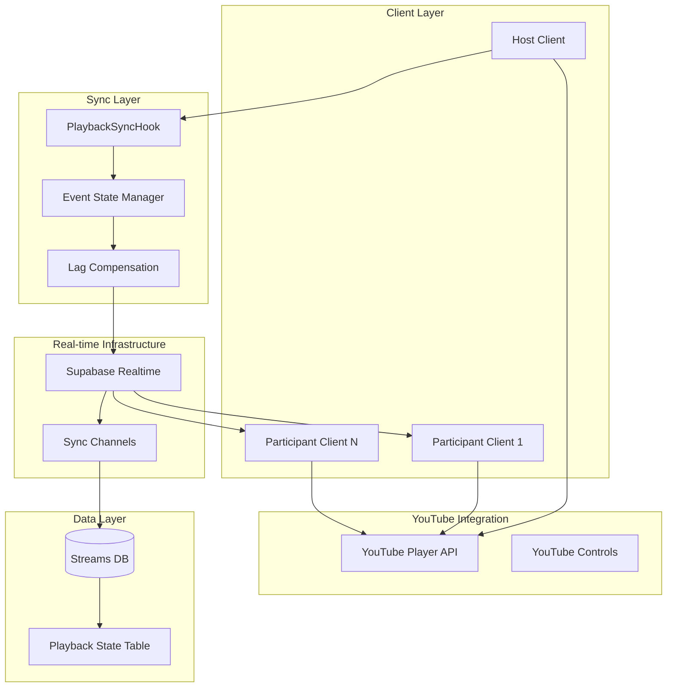

# Playback Synchronization - Design Document

## Overview

The Playback Synchronization system enables real-time synchronized video playback across all participants in a streaming session. The system leverages the existing Supabase real-time infrastructure, YouTube Player API integration, and stream participant management to create a seamless shared viewing experience.

The architecture follows a host-participant model where the stream host controls playback (play, pause, seek) and all participants automatically sync to match the host's state. The system includes network lag compensation, error recovery, and robust connection management to handle real-world network conditions.

## Architecture

### High-Level Architecture



### Component Architecture

The system is built on four main architectural layers:

1. **YouTube Integration Layer**: Direct integration with YouTube Player API for video control
2. **Synchronization Layer**: Core sync logic, event management, and lag compensation
3. **Real-time Communication Layer**: Supabase real-time channels for event broadcasting
4. **Data Persistence Layer**: Database storage for sync state and recovery

## Components and Interfaces

### 1. Enhanced PlaybackSync Hook

**File**: `src/features/streaming/hooks/use-playback-sync.ts`

The core hook manages all synchronization logic and integrates with existing infrastructure:

```typescript
interface UsePlaybackSyncProps {
  streamId: string;
  userId: string;
  isHost: boolean;
  youtubePlayerRef: React.RefObject<YouTubePlayer>;
}

interface PlaybackSyncState {
  // Current sync state
  playbackState: PlaybackState;
  syncStatus: "connected" | "disconnected" | "syncing" | "error";
  lastSyncAt: Date | null;

  // Connection management
  isConnected: boolean;
  connectionQuality: "good" | "poor" | "unstable";

  // Host-specific methods
  broadcastPlaybackEvent: (event: PlaybackEvent) => Promise<void>;

  // Participant-specific methods
  requestSync: () => Promise<void>;

  // Error handling
  error: string | null;
  clearError: () => void;

  // Manual controls
  forceSync: () => Promise<void>;
  toggleSyncEnabled: (enabled: boolean) => void;
}

interface PlaybackEvent {
  type:
    | "play"
    | "pause"
    | "seek"
    | "sync_request"
    | "buffer_start"
    | "buffer_end";
  timestamp: number;
  currentTime: number;
  hostUserId: string;
  eventId: string; // For deduplication
  metadata?: {
    seekFrom?: number; // For seek events
    bufferReason?: string; // For buffer events
  };
}
```

### 2. YouTube Player Integration Service

**File**: `src/features/streaming/services/youtube-player.service.ts`

Handles all YouTube Player API interactions with error handling and state management:

```typescript
interface YouTubePlayerService {
  // Player control methods
  play(): Promise<void>;
  pause(): Promise<void>;
  seekTo(seconds: number, allowSeekAhead?: boolean): Promise<void>;

  // State retrieval methods
  getCurrentTime(): Promise<number>;
  getPlayerState(): Promise<YT.PlayerState>;
  getDuration(): Promise<number>;

  // Event handling
  onStateChange(callback: (event: YT.OnStateChangeEvent) => void): void;
  onReady(callback: (event: YT.PlayerEvent) => void): void;
  onError(callback: (event: YT.OnErrorEvent) => void): void;

  // Sync-specific methods
  syncToState(state: PlaybackState): Promise<void>;
  getDetailedState(): Promise<DetailedPlaybackState>;

  // Error recovery
  reload(): Promise<void>;
  isPlayerReady(): boolean;
}

interface DetailedPlaybackState extends PlaybackState {
  playerState: YT.PlayerState;
  videoLoadedFraction: number;
  availableQualityLevels: string[];
  playbackQuality: string;
  bufferedTimeRanges: TimeRanges;
}
```

### 3. Sync Event Manager

**File**: `src/features/streaming/services/sync-event-manager.ts`

Manages event broadcasting, deduplication, and ordering:

```typescript
interface SyncEventManager {
  // Event broadcasting
  broadcastEvent(event: PlaybackEvent): Promise<void>;

  // Event processing
  processIncomingEvent(event: PlaybackEvent): Promise<void>;

  // Event queue management
  queueEvent(event: PlaybackEvent): void;
  processEventQueue(): Promise<void>;
  clearEventQueue(): void;

  // Deduplication
  isDuplicateEvent(event: PlaybackEvent): boolean;
  markEventProcessed(eventId: string): void;

  // Rate limiting
  canBroadcastEvent(): boolean;
  getRemainingRateLimit(): number;
}
```

### 4. Lag Compensation Engine

**File**: `src/features/streaming/services/lag-compensation.service.ts`

Handles network delay compensation and sync tolerance:

```typescript
interface LagCompensationService {
  // Compensation calculations
  calculateSyncAdjustment(
    hostTime: number,
    participantTime: number,
    networkDelay: number
  ): SyncAdjustment;

  // Network monitoring
  measureNetworkDelay(): Promise<number>;
  getConnectionQuality(): "good" | "poor" | "unstable";

  // Sync tolerance management
  shouldApplySync(timeDifference: number): boolean;
  getSyncTolerance(): number;
  adjustToleranceForConnection(quality: string): void;

  // Drift detection
  detectSyncDrift(hostState: PlaybackState, localState: PlaybackState): boolean;
  calculateDriftCorrection(drift: number): SyncCorrection;
}

interface SyncAdjustment {
  shouldSync: boolean;
  targetTime: number;
  syncType: "immediate" | "gradual" | "skip";
  confidence: number;
}

interface SyncCorrection {
  correctionType: "seek" | "playback_rate" | "buffer_wait";
  targetTime: number;
  duration: number;
}
```

### 5. Enhanced Stream Video Player Component

**File**: `src/features/streaming/components/StreamVideoPlayer.tsx`

Updated to integrate with the new sync system:

```typescript
interface StreamVideoPlayerProps {
  streamId: string;
  media: StreamMedia;
  isHost: boolean;
  currentUserId: string;
  onPlaybackChange?: (state: PlaybackState) => void;
  onSyncStatusChange?: (status: SyncStatus) => void;
  syncEnabled?: boolean;
}

interface SyncStatus {
  connected: boolean;
  syncing: boolean;
  lastSyncAt: Date | null;
  error: string | null;
  participantCount: number;
}
```

## Data Models

### 1. Enhanced Streams Table

The existing streams table is extended with additional sync-related columns:

```sql
-- Additional columns for playback synchronization
ALTER TABLE streams ADD COLUMN IF NOT EXISTS current_time INTEGER DEFAULT 0;
ALTER TABLE streams ADD COLUMN IF NOT EXISTS is_playing BOOLEAN DEFAULT false;
ALTER TABLE streams ADD COLUMN IF NOT EXISTS last_sync_at TIMESTAMP DEFAULT NOW();
ALTER TABLE streams ADD COLUMN IF NOT EXISTS video_url TEXT;
ALTER TABLE streams ADD COLUMN IF NOT EXISTS sync_enabled BOOLEAN DEFAULT true;
ALTER TABLE streams ADD COLUMN IF NOT EXISTS sync_tolerance INTEGER DEFAULT 500; -- milliseconds
```

### 2. Playback Events Table

New table for event logging and recovery:

```sql
CREATE TABLE playback_events (
  id UUID PRIMARY KEY DEFAULT gen_random_uuid(),
  stream_id UUID NOT NULL REFERENCES streams(id) ON DELETE CASCADE,
  host_user_id UUID NOT NULL REFERENCES auth.users(id),
  event_type TEXT NOT NULL CHECK (event_type IN ('play', 'pause', 'seek', 'sync_request', 'buffer_start', 'buffer_end')),
  event_id TEXT NOT NULL UNIQUE, -- For deduplication
  timestamp_ms BIGINT NOT NULL, -- Unix timestamp in milliseconds
  current_time INTEGER NOT NULL, -- Video position in seconds
  metadata JSONB DEFAULT '{}',
  created_at TIMESTAMP DEFAULT NOW(),

  -- Indexes for performance
  INDEX idx_playback_events_stream_timestamp (stream_id, timestamp_ms),
  INDEX idx_playback_events_event_id (event_id),
  INDEX idx_playback_events_cleanup (created_at) -- For cleanup jobs
);
```

### 3. Sync State Management

TypeScript interfaces for sync state:

```typescript
interface PlaybackState {
  currentTime: number;
  isPlaying: boolean;
  duration: number;
  volume: number;
  isFullscreen: boolean;
  // Enhanced sync properties
  lastSyncAt: Date;
  syncVersion: number; // For conflict resolution
  hostUserId: string;
}

interface SyncMetrics {
  averageLatency: number;
  syncAccuracy: number; // Percentage of successful syncs
  driftFrequency: number; // How often drift correction is needed
  connectionStability: number; // Connection quality score
  lastMeasuredAt: Date;
}

interface SyncConfiguration {
  tolerance: number; // Sync tolerance in milliseconds
  maxDrift: number; // Maximum allowed drift before hard sync
  bufferThreshold: number; // Buffering threshold for sync pausing
  rateLimit: number; // Max events per second
  retryAttempts: number; // Max retry attempts for failed syncs
}
```

## Error Handling

### 1. Connection Error Recovery

```typescript
interface ConnectionErrorHandler {
  // Connection monitoring
  monitorConnection(): void;
  handleConnectionLoss(): Promise<void>;
  handleReconnection(): Promise<void>;

  // Recovery strategies
  attemptReconnect(maxAttempts: number): Promise<boolean>;
  fallbackToPolling(): void;
  restoreFromPolling(): void;

  // State recovery
  requestCurrentState(): Promise<PlaybackState>;
  validateStateConsistency(): Promise<boolean>;
  performFullResync(): Promise<void>;
}
```

### 2. YouTube Player Error Handling

```typescript
interface YouTubeErrorHandler {
  // Player error recovery
  handlePlayerError(error: YT.PlayerError): Promise<void>;
  reloadPlayer(): Promise<void>;
  switchVideoQuality(quality: string): Promise<void>;

  // Buffering management
  handleBuffering(): void;
  waitForBuffer(): Promise<void>;
  skipBufferingSegment(): Promise<void>;

  // API error handling
  handleAPIRateLimit(): Promise<void>;
  handleVideoUnavailable(): Promise<void>;
  handleEmbedRestrictions(): Promise<void>;
}
```

### 3. Sync Conflict Resolution

```typescript
interface SyncConflictResolver {
  // Conflict detection
  detectConflict(hostState: PlaybackState, localState: PlaybackState): boolean;

  // Resolution strategies
  resolveByHostAuthority(hostState: PlaybackState): Promise<void>;
  resolveByTimestamp(states: PlaybackState[]): Promise<PlaybackState>;
  resolveByMajority(participantStates: PlaybackState[]): Promise<PlaybackState>;

  // Conflict prevention
  preventRapidStateChanges(): void;
  debounceStateUpdates(delay: number): void;
  validateStateTransition(from: PlaybackState, to: PlaybackState): boolean;
}
```

## Testing Strategy

### 1. Unit Testing

**Test Coverage Areas:**

- PlaybackSync hook state management
- YouTube Player service methods
- Lag compensation calculations
- Event deduplication logic
- Error recovery mechanisms

**Key Test Files:**

- `src/features/streaming/hooks/__tests__/use-playback-sync.test.ts`
- `src/features/streaming/services/__tests__/youtube-player.service.test.ts`
- `src/features/streaming/services/__tests__/lag-compensation.service.test.ts`

### 2. Integration Testing

**Test Scenarios:**

- Host-participant sync flow
- Network interruption recovery
- Multiple participant synchronization
- YouTube Player API integration
- Database state persistence

**Test Files:**

- `src/features/streaming/__tests__/playback-sync.integration.test.ts`
- `src/features/streaming/__tests__/multi-participant-sync.test.ts`

### 3. End-to-End Testing

**Test Scenarios:**

- Complete watch party session
- Host transfer during playback
- Network quality variations
- Mobile device compatibility
- Cross-browser synchronization

### 4. Performance Testing

**Metrics to Monitor:**

- Sync latency (target: <500ms)
- Event processing throughput
- Memory usage during long sessions
- Database query performance
- Real-time subscription efficiency

## Implementation Phases

### Phase 1: Core Sync Infrastructure (Week 1-2)

1. Enhance `use-playback-sync` hook with YouTube integration
2. Implement `SyncEventManager` for event broadcasting
3. Create `YouTubePlayerService` for player control
4. Add database schema changes for sync state
5. Implement basic host-participant sync flow

### Phase 2: Lag Compensation & Error Handling (Week 3)

1. Implement `LagCompensationService` with network monitoring
2. Add comprehensive error handling for connection issues
3. Implement YouTube Player error recovery
4. Add sync conflict resolution mechanisms
5. Create fallback strategies for poor connections

### Phase 3: Advanced Features & Optimization (Week 4)

1. Implement host transfer functionality
2. Add manual sync controls and status indicators
3. Optimize performance for multiple participants
4. Add comprehensive logging and monitoring
5. Implement cleanup jobs for old sync events

### Phase 4: Testing & Polish (Week 5)

1. Complete unit and integration test coverage
2. Perform end-to-end testing across devices
3. Optimize for mobile and cross-browser compatibility
4. Add user interface improvements and feedback
5. Performance tuning and final optimizations

## Security Considerations

### 1. Host Authorization

- Verify host status before processing playback commands
- Implement host transfer validation
- Prevent unauthorized playback control

### 2. Event Validation

- Validate all incoming sync events
- Implement rate limiting to prevent spam
- Sanitize event metadata

### 3. Data Privacy

- Limit sync event data to necessary information
- Implement automatic cleanup of old events
- Ensure user privacy in sync logs

## Performance Optimizations

### 1. Event Processing

- Debounce rapid successive events
- Batch process multiple events
- Implement efficient event deduplication

### 2. Database Operations

- Use database indexes for sync queries
- Implement connection pooling
- Cache frequently accessed sync state

### 3. Real-time Subscriptions

- Optimize Supabase channel subscriptions
- Implement subscription cleanup
- Use efficient filtering for large streams

### 4. Memory Management

- Clean up event listeners on unmount
- Implement garbage collection for old events
- Optimize state management for long sessions

This design provides a comprehensive foundation for implementing robust, real-time playback synchronization that integrates seamlessly with the existing Zoovie streaming infrastructure while handling the complexities of network latency, error recovery, and multi-participant coordination.
